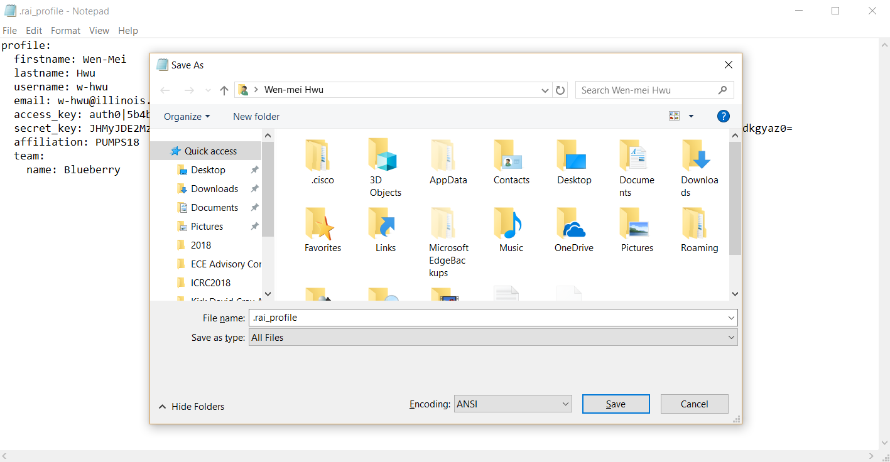

# PUMPS+AI 2021


Welcome to the [PUMPS+AI 2021 Summer School](https://pumps.bsc.es/2019/).
This page contains information about how to access and submit the labs.
- [Install and Setup](#install-and-setup)
    - [Windows](#windows)
- [Labs](#labs)
- [Code Development Tools](#code-development-tools)
  - [Timing the Code Sections](#timing-the-code-sections)
  - [Utility Functions](#utility-functions)
  - [Verifying the Results](#verifying-the-results)
  - [Checking Errors](#checking-errors)
  - [Profiling](#profiling)
  - [Downloading Your Output Code](#downloading-your-output-code)
  - [Enabling Debug builds](#enabling-debug-builds)
  - [Offline Development](#offline-development)
  - [Issues](#issues)
  - [License](#license)

# Install and Setup

Clone this repository to get the project folder.

    git clone https://github.com/illinois-impact/gpu-algorithms-labs.git

Download the rai binary for your platform below.
You will probably use it for development, and definitely use it for submission.

[Linux and Darwin rai binaries](https://drive.google.com/drive/folders/1Pp84x3So9OEHUwRHQVZcRP441wRsO-UV)

You should have received a `.rai_profile` file by email.
Put that file in `~/.rai_profile` (Linux/macOS) or `%HOME%/.rai_profile` (Windows).
Your `.rai_profile` should look something like this (indented with tabs!)

    profile:
        firstname: <your-given-name>
        lastname: <your-surname>
        username: <your-username>
        email: <your-institution-email>
        access_key: <your-access-key>
        secret_key: <your-secret-key>
        affiliation: <your-affiliation>

Some more info is available on the [Client Documentation Page](https://github.com/rai-project/rai).

### Windows

****
On Windows, you'll need to open notepad and paste the profile output given. Then `SaveAs` and type in `%HOMEPATH%`.
Type in `.rai_profile` as the name of the file and change the file type to `all`.
The screenshot below shows what it should look like.




# Labs

Several labs will be assigned over the course of the week

* [Device Query](https://github.com/illinois-impact/gpu-algorithms-labs/tree/su2021_pumps/labs/device_query)
* [Scatter](https://github.com/illinois-impact/gpu-algorithms-labs/tree/su2021_pumps/labs/scatter)/[Gather](https://github.com/illinois-impact/gpu-algorithms-labs/tree/su2021_pumps/labs/gather) ( <- **two-part lab!!!**)
* [Joint-tiled SGEMM](https://github.com/illinois-impact/gpu-algorithms-labs/tree/su2021_pumps/labs/sgemm-regtiled-coarsened)
* [Binning](https://github.com/illinois-impact/gpu-algorithms-labs/tree/su2021_pumps/labs/binning)
* [BFS](https://github.com/illinois-impact/gpu-algorithms-labs/tree/su2021_pumps/labs/bfs)
* [Convolution](https://github.com/illinois-impact/gpu-algorithms-labs/tree/su2021_pumps/labs/basic_conv)
* [Tiled Convolution](https://github.com/illinois-impact/gpu-algorithms-labs/tree/su2021_pumps/labs/tiled_conv)

The main code of each lab is in the `main.cu`, which is the file you will be editing. Helper code that's specific to the lab is in the `helper.hpp` file and the common code across the labs in the `common` folder. You are free to add/delete/rename files but you need to make the appropriate changes to the `CMakeLists.txt` file.

To run any lab you `cd` into that directory, `cd labs/device_query` for example, and run `rai -p .` .
From a user's point a view when the client runs as if it was local.
Some more info is available on the [Client Documentation Page](https://github.com/rai-project/rai).

_NOTE:_ You may need to use the absolute path if submitting from windows.

# Code Development **Tools**

Throughout the summer school you'll be developing the labs. The folowing information is common through all the labs and might be helpful while developing.

## Timing the Code Sections

It might be useful to figure out the time of each code section to identify the bottleneck code.
In `common/utils.hpp` a function called `timer_start/timer_stop` which allows you to get the current time at a high resolution.
To measure the overhead of a function `f(args...)`, the pattern to use is:

```{.cpp}
timer_start(/* msg */ "calling the f(args...) function");
f(args...);
timer_stop();
```

This will print the time as the code is running.


## Utility Functions

We provide some helper utility functions in the `common/utils.hpp` file.

## Verifying the Results

Each lab contains the code to compute the golden (true) solution of the lab. We use [Catch2](https://github.com/catchorg/Catch2) to perform tests to verify the results are accurate within the error tollerance. You can read the [Catch2 tutorial](https://github.com/catchorg/Catch2/blob/master/docs/tutorial.md#top) if you are interested in how this works.

Subsets of the test cases can be run by executing a subset of the tests. We recomend running the first lab with `-h` option to understand what you can perform, but the rough idea is if you want to run a specific section (say `[inputSize:1024]`) then you pass `-c "[inputSize:1024]"` to the lab.


_NOTE:_ The labs are configured to abort on the first error (using the `-a` option in the `rai_build.yml` file). You may need to change this to show the full list of errors.

## Checking Errors

To check and throw CUDA errors, use the THROW_IF_ERROR function. This throws an error when a CUDA error is detected which you can catch if you need special handling of the error.

```{.cpp}
THROW_IF_ERROR(cudaMalloc((void **)&deviceW, wByteCount));
```


## Profiling

Profiling can be performed using `nvprof`. Place the following build commands in your `rai-build.yml` file

```**yaml**
    - >-
      nvprof --cpu-profiling on --export-profile timeline.nvprof --
      ./mybinary -i input1,input2 -o output
    - >-
      nvprof --cpu-profiling on --export-profile analysis.nvprof --analysis-metrics --
      ./mybinary -i input1,input2 -o output
```

You could change the input and test datasets. This will output two files `timeline.nvprof` and `analysis.nvprof` which can be viewed using the `nvvp` tool (by performing a `file>import`). You will have to install the nvvp viewer on your machine to view these files.

_NOTE:_ `nvvp` will only show performance metrics for GPU invocations, so it may not show any analysis when you only have serial code.

You will need to install the nvprof viewer for the CUDA website and the nvprof GUI can be run without CUDA on your machine.

## Downloading Your Output Code

All data files that are in the `/build` folder are temporarily uploaded to a file storage server. This allows you to dump output files during execution and analyze them locally.

```
✱ The build folder has been uploaded to http://s3.amazonaws.com/files.rai-project.com/abc.tar.gz. The data will be present for only a short duration of time.
```


## Enabling Debug builds

Within the `rai_build.yml` environment, run `cmake -DCMAKE_BUILD_TYPE=Debug /src` this will enable debugging mode. You may also want to pass the `-g -pg -lineinfo` option to the compiler.

## Offline Development

You can use the docker image and or install CMake within a CUDA envrionment. Then run `cmake [lab]` and then `make`. We do not using your own machine, and we will not be debugging your machine/installation setup.

## Issues


Please use the [Github issue manager] to report any issues or suggestions.

Include the outputs of

```bash
rai version
```

as well as the output of

```bash
rai buildtime
```

In your bug report. You can also invoke the `rai` command with verbose and debug outputs using

```bash
rai --verbose --debug
```

[github issue manager]: https://github.com/illinois-impact/pumps/issues

## License

NCSA/UIUC © [Abdul Dakkak](http://impact.crhc.illinois.edu/Content_Page.aspx?student_pg=Default-dakkak)


